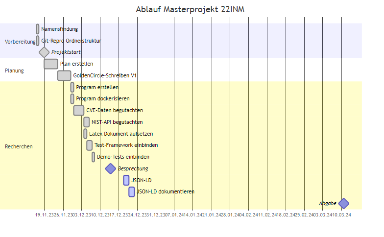
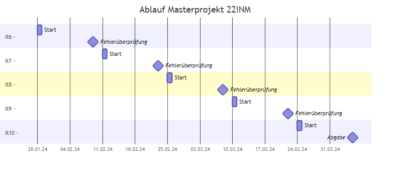

# Am I Vulnerable
Masterprojekt des Jahrgangs 22INM der HTWK Leipzig

<table style="width: 100%">
    <tr>
        <td>Betreuender Professor</td>
        <td><a href="mailto:andreas.both@htwk-leipzig.de">Prof. Dr. Andreas Both</a></td>
    </tr>
    <tr>
        <td>Absolventen</td>
        <td>
            <a href="mailto:andreas.both@htwk-leipzig.de">Konstantin Blechschmidt</a> 
            <a href="mailto:andreas.both@htwk-leipzig.de">Tim Kretzschmar</a>
        </td>
    </tr>
</table>

## Planung

## Vorbereitung - Golden Circle
### Motivation
Die Nutzung frei verfügbarer Pakete sind im Arbeitsalltag gang und gäbe.
Freiwillige oder Hobby-Programmierer ermöglichen mit ihrem Einsatz, dass weltweit die Entwicklung neuer Software sowohl im kommerziellen als auch privaten und öffentlichen Bereich vereinfacht, vereinheitlicht und beschleunigt wird.

Dank der Konkurrenz freier Pakete, zum Beispiel anhand ihrer Nutzungszahl, gestaltet sich dort ein Wettbewerb, der gute Pakete beständig besser werden lässt und nicht durchdachte entweder (a) in die Bedeutungslosigkeit befördert oder (b) soweit verbessert, dass ihre Funktionen und Benutzbarkeit anschließend überzeugen konnten.

Ein anderer essentieller Aspekt außer der Nutzbarkeit oder Funktionserfüllung ist die Sicherheit.
Eben jene muss sich bei jedem Paket separat und gekapselt gesehen auf einem solchem Niveau befinden, dass ihre Verwendung keine fahrlässig Gefahr darstellt.

Dies beginnt bei zu kurzen Schlüssellängen und endet bei komplexen Programmen mit verschiedenen Angriffsschwachstellen.

Der Aufgabe <i>Einschätzung der Sicherheit und Einhaltung von Standards</i> hat sich die Mitre Corporation gestellt; eine us-amerikanische Forschungsabteilung der "National Cybersecurity FFRDC", die staatliche Finanzierung genießt.
CVE nennt sich ihr Referenziersystem und stellt dabei die englische Abkürzung "Common Vulnerabilities and Exposures" dt. Bekannte Schwachstellen und Anfälligkeiten dar.

Aber die Aufgabe, für jedes verwendete Paket einzeln die Sicherheitslücken nachzulesen oder für eine Paketsammlung nachzuvollziehen, ist selbst mit dem Angebot der "National Cybersecurity FFRDC" zeitaufwendig und ressourcenintensiv - schließlich werden so personelle Kräfte und Rechenkapazitäten gebunden.

Eine Automatisierung der Analyse solcher Pakete zielt somit nicht nur eine Reduktion des Zeitaufwandes mit sich, auch ist eine umfangreichere Analyse ohne Mehraufwand möglich.
Dies spiegelt sich beispielsweise in der Möglichkeit wieder, ganze Projekte direkt analysieren zu lassen anstelle der einzelnen Pakete.

### Ziele
