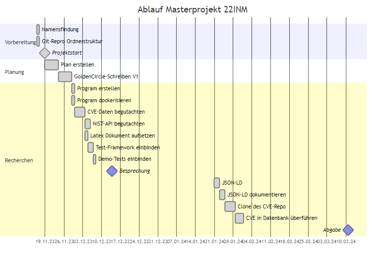

# Am I Vulnerable
Masterprojekt des Jahrgangs 22INM der HTWK Leipzig

<table style="width: 100%">
    <tr>
        <td>Betreuender Professor</td>
        <td><a href="mailto:andreas.both@htwk-leipzig.de">Prof. Dr. Andreas Both</a></td>
    </tr>
    <tr>
        <td>Absolventen</td>
        <td>
            <a href="mailto:andreas.both@htwk-leipzig.de">Konstantin Blechschmidt</a> 
            <a href="mailto:andreas.both@htwk-leipzig.de">Tim Kretzschmar</a>
        </td>
    </tr>
</table>

## Planung

<figcaption><a href="documentation/planning/procedure.md">Speicherort der Rohdatei</a></figcaption>
Hier der geplante und immer wieder aktualisierte Fortschritt des Projektes.

## Projekt-Verwaltungsstruktur
### Ordnerstruktur
- [Code](code/)
    - [Anwendung](code/AmIVulnerable/)
- [Dokumentation](documentation/)
    - [Ausarbeitung/Paper](documentation/latex/)
    - [Planungsdokumentation](documentation/planning/)

## Vorbereitung - Golden Circle
### Motivation
Die Nutzung frei verfügbarer Pakete sind im Arbeitsalltag gang und gäbe.
Freiwillige oder Hobby-Programmierer ermöglichen mit ihrem Einsatz, dass weltweit die Entwicklung neuer Software sowohl im kommerziellen als auch privaten und öffentlichen Bereich vereinfacht, vereinheitlicht und beschleunigt wird.

Dank der Konkurrenz freier Pakete, zum Beispiel anhand ihrer Nutzungszahl, gestaltet sich dort ein Wettbewerb, der gute Pakete beständig besser werden lässt und nicht durchdachte entweder (a) in die Bedeutungslosigkeit befördert oder (b) soweit verbessert, dass ihre Funktionen und Benutzbarkeit anschließend überzeugen konnten.

Ein anderer essentieller Aspekt außer der Nutzbarkeit oder Funktionserfüllung ist die Sicherheit.
Eben jene muss sich bei jedem Paket separat und gekapselt gesehen auf einem solchem Niveau befinden, dass ihre Verwendung keine fahrlässig Gefahr darstellt.

Dies beginnt bei zu kurzen Schlüssellängen und endet bei komplexen Programmen mit verschiedenen Angriffsschwachstellen.

Der Aufgabe <i>Einschätzung der Sicherheit und Einhaltung von Standards</i> hat sich die Mitre Corporation gestellt; eine us-amerikanische Forschungsabteilung der "National Cybersecurity FFRDC", die staatliche Finanzierung genießt.
CVE nennt sich ihr Referenziersystem und stellt dabei die englische Abkürzung "Common Vulnerabilities and Exposures" dt. Bekannte Schwachstellen und Anfälligkeiten dar.

Aber die Aufgabe, für jedes verwendete Paket einzeln die Sicherheitslücken nachzulesen oder für eine Paketsammlung nachzuvollziehen, ist selbst mit dem Angebot der "National Cybersecurity FFRDC" zeitaufwendig und ressourcenintensiv - schließlich werden so personelle Kräfte und Rechenkapazitäten gebunden.

Eine Automatisierung der Analyse solcher Pakete zielt somit nicht nur eine Reduktion des Zeitaufwandes mit sich, auch ist eine umfangreichere Analyse ohne Mehraufwand möglich.
Dies spiegelt sich beispielsweise in der Möglichkeit wieder, ganze Projekte direkt analysieren zu lassen anstelle der einzelnen Pakete.

### Ziele
Dank der CVE-Daten ist es möglich für Pakete bekannte Sicherheitsprobleme zu ermitteln.

CVE-Nummern sind verteilte Nummern der CNA - CVE-numbering authority - die spezifische Schwachstellen einer Software beschreiben.
Zusammengefasst lokalisiert auf der Webseite der CVE https://www.cve.org/Downloads, können diese dort eingesehen können.

Ziel der Ausarbeitung und des begleitenden Projektes ist die vereinfachte Analyse von Projekten mithilfe dieser CVE-Daten.

Es soll untersucht werden,

1. inwieweit ganze Projekte mit ihren Abhängigkeiten performant erfasst und
2. Sicherheitslücken ermittelt aus den CVE Daten weiterverarbeitbar aufbereitet

werden können.

### Vorgehen und Maßnahmen
Diese Arbeit begleitet den Entwicklungsfortschritt eines Webservices und dessen Analyse.

Umgesetzt als ASP.NET Core-Web-API wird dieser Dienst in einem Docker-Netzwerk realisiert und die Daten der Mitre Corporation in eine eigene Datenbank überführt.
Mittels dieser soll bei Anfrage an die API eine Suche gestartet werden, ob sich ein sicherheitsauffälliges Paket finden lässt und dies dann zurückgegeben werden.

Die Resultate werden im [JSON-LD Format](https://json-ld.org/) zurückgegeben und sollen dort die wichtigsten Parameter für den Anfragesteller gebündelt zurückgeben.

Im Ersten Schritt ist dies mit der Übergabe eines einzelnen Paketes gedacht - ähnlich der Webseite [cvedetails.com](https://www.cvedetails.com/vulnerability-search.php).  
Anschließend ist die Umsetzung auf ein Framework geplant, wo zuerst ein Abhängigkeitsbaum ermittelt werden muss und darauf aufbauend eine Rückgabe eventuell gefundener Probleme.  
Weitere zusätzliche Schritte sind je nach Zeit und Machbarkeit noch nicht näher definiert.

Die Ausarbeitung verfolgt ebenfalls den Zweck, die Planung, Erkenntnisse und Wege der Verifizierung verschiedener einzelner Pläne zu begleiten.
Somit wird für spätere weiterführende Projekte eine Möglichkeit geschaffen, exemplarisch aufgetretene Probleme abzugleichen oder zu umgehen.

