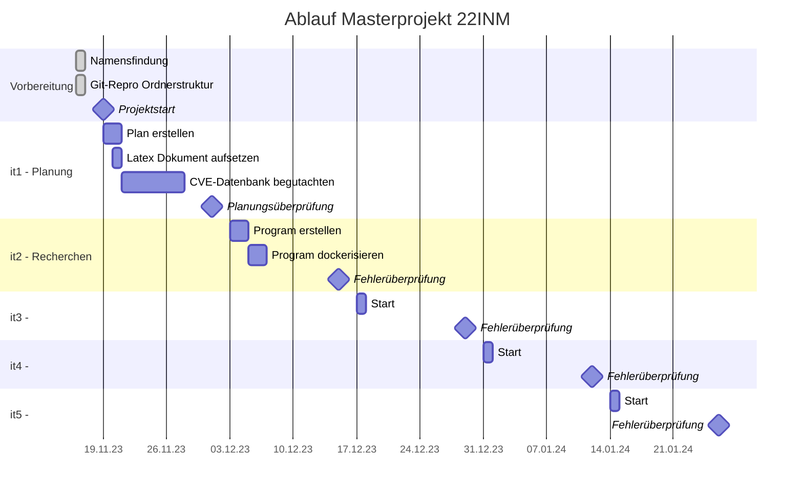
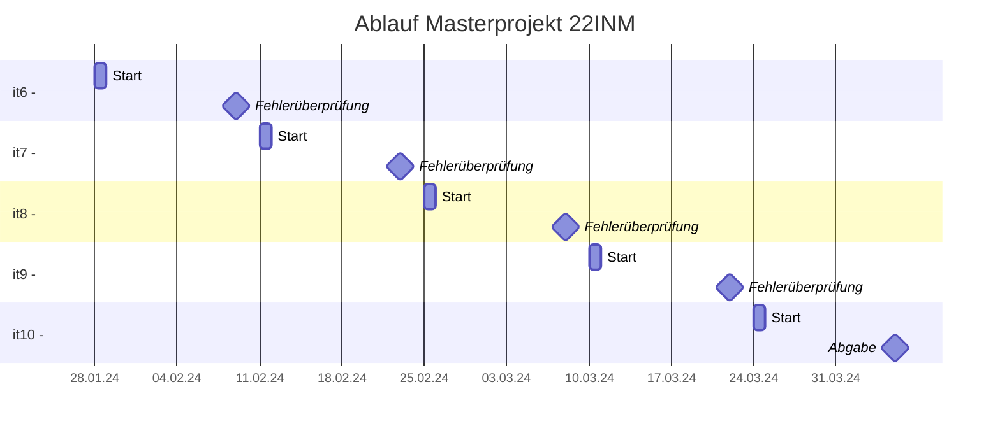

```mermaid
gantt
    dateFormat  YYYY-MM-DD
    axisFormat  %d.%m.%y
    title       Ablauf Masterprojekt 22INM
    todayMarker off

    section Vorbereitung
    Namensfindung: done, V-1, 2023-11-16, 1d
    Git-Repro Ordnerstruktur: done, V-2, 2023-11-16, 1d

    Projektstart: milestone, 2023-11-19, 0d

    section it1 - Planung
    Plan erstellen: it1-1, 2023-11-19, 2d
    Latex Dokument aufsetzen: it1-2, 2023-11-20, 1d
    CVE-Datenbank begutachten: it1-3, after it1-2, 7d

    Planungsüberprüfung: milestone, 2023-12-01, 0d

    section it2 - Recherchen
    Program erstellen: it2-1, 2023-12-03, 2d
    Program dockerisieren: it2-3, after it2-1, 2d

    Fehlerüberprüfung: milestone, 2023-12-15, 0d

    section it3 - 
    Start: it3-1, 2023-12-17, 1d
    
    Fehlerüberprüfung: milestone, 2023-12-29, 0d

    section it4 - 
    Start: it4-1, 2023-12-31, 1d

    Fehlerüberprüfung: milestone, 2024-01-12, 0d

    section it5 - 
    Start: it5-1, 2024-01-14, 1d

    Fehlerüberprüfung: milestone, 2024-01-26, 0d
```

```mermaid
gantt
    dateFormat  YYYY-MM-DD
    axisFormat  %d.%m.%y
    title       Ablauf Masterprojekt 22INM
    todayMarker off

    section it6 - 
    Start: it6-1, 2024-01-28, 1d

    Fehlerüberprüfung: milestone, 2024-02-09, 0d

    section it7 - 
    Start: it7-1, 2024-02-11, 1d

    Fehlerüberprüfung: milestone, 2024-02-23, 0d

    section it8 - 
    Start: it7-1, 2024-02-25, 1d

    Fehlerüberprüfung: milestone, 2024-03-08, 0d

    section it9 - 
    Start: it7-1, 2024-03-10, 1d

    Fehlerüberprüfung: milestone, 2024-03-22, 0d

    section it10 - 
    Start: it7-1, 2024-03-24, 1d

    Abgabe: milestone, 2024-04-05, 0d
```
