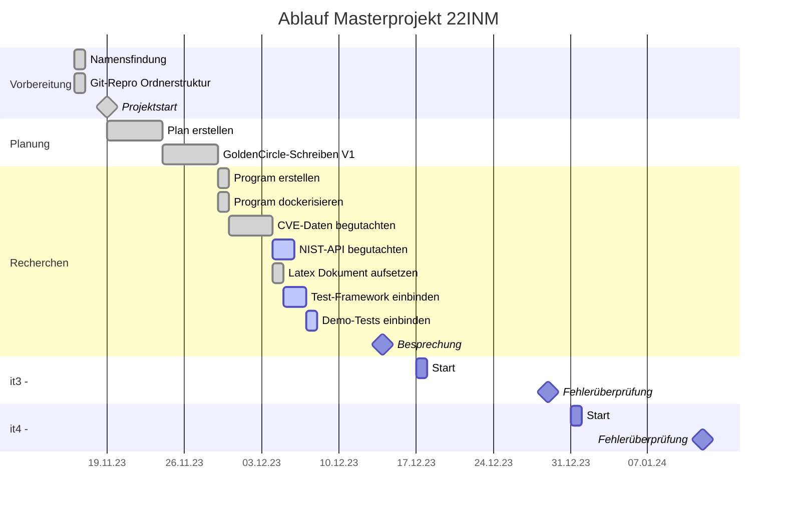
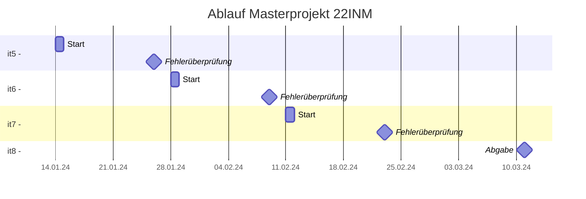

```mermaid
gantt
    dateFormat  YYYY-MM-DD
    axisFormat  %d.%m.%y
    title       Ablauf Masterprojekt 22INM
    todayMarker off

    section Vorbereitung
    Namensfindung: done, V-1, 2023-11-16, 1d
    Git-Repro Ordnerstruktur: done, V-2, 2023-11-16, 1d

    Projektstart: done, milestone, 2023-11-19, 0d

    section Planung
    Plan erstellen: done, planerstellen, 2023-11-19, 5d

    GoldenCircle-Schreiben V1: done, goldencircleschreiben, after planerstellen, 5d

    section Recherchen

    Program erstellen: done, programmerstellen, after goldencircleschreiben, 1d
    Program dockerisieren: done, programmdockerisieren, after goldencircleschreiben, 1d

    CVE-Daten begutachten: done, cvedatenbegutachten, after programmdockerisieren, 4d
    NIST-API begutachten: active, nistapibegutachten, after cvedatenbegutachten, 2d

    Latex Dokument aufsetzen: done, latexdokumentaufsetzen, after cvedatenbegutachten, 1d

    Test-Framework einbinden: active, testframeworkeinbinden, after latexdokumentaufsetzen, 2d
    Demo-Tests einbinden: active, demotestseinbinden, after testframeworkeinbinden, 1d

    Besprechung: milestone, 2023-12-14, 0d

    section it3 - 
    Start: it3-1, 2023-12-17, 1d
    
    Fehlerüberprüfung: milestone, 2023-12-29, 0d

    section it4 - 
    Start: it4-1, 2023-12-31, 1d

    Fehlerüberprüfung: milestone, 2024-01-12, 0d

```

```mermaid
gantt
    dateFormat  YYYY-MM-DD
    axisFormat  %d.%m.%y
    title       Ablauf Masterprojekt 22INM
    todayMarker off

    section it5 - 
    Start: it5-1, 2024-01-14, 1d

    Fehlerüberprüfung: milestone, 2024-01-26, 0d

    section it6 - 
    Start: it6-1, 2024-01-28, 1d

    Fehlerüberprüfung: milestone, 2024-02-09, 0d

    section it7 - 
    Start: it7-1, 2024-02-11, 1d

    Fehlerüberprüfung: milestone, 2024-02-23, 0d

    section it8 - 

    Abgabe: milestone, 2024-03-11, 0d
```
