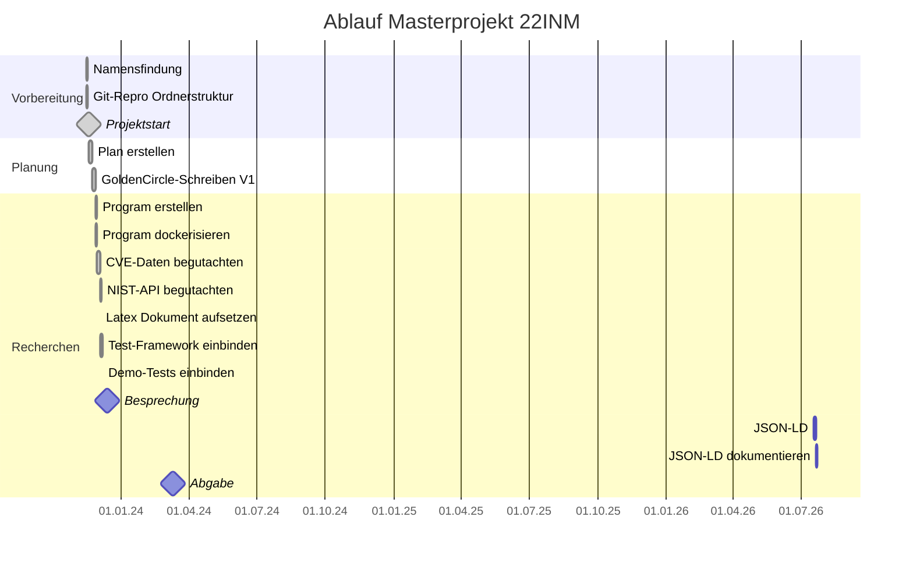

```mermaid
gantt
    dateFormat  YYYY-MM-DD
    axisFormat  %d.%m.%y
    title       Ablauf Masterprojekt 22INM
    todayMarker off

    section Vorbereitung
    Namensfindung: done, V-1, 2023-11-16, 1d
    Git-Repro Ordnerstruktur: done, V-2, 2023-11-16, 1d

    Projektstart: done, milestone, 2023-11-19, 0d

    section Planung
    Plan erstellen: done, planerstellen, 2023-11-19, 5d

    GoldenCircle-Schreiben V1: done, goldencircleschreiben, after planerstellen, 5d

    section Recherchen

    Program erstellen: done, programmerstellen, after goldencircleschreiben, 1d
    Program dockerisieren: done, programmdockerisieren, after goldencircleschreiben, 1d

    CVE-Daten begutachten: done, cvedatenbegutachten, after programmdockerisieren, 4d
    NIST-API begutachten: done, nistapibegutachten, after cvedatenbegutachten, 2d

    Latex Dokument aufsetzen: done, latexdokumentaufsetzen, after cvedatenbegutachten, 1d

    Test-Framework einbinden: done, testframeworkeinbinden, after latexdokumentaufsetzen, 2d
    Demo-Tests einbinden: done, demotestseinbinden, after testframeworkeinbinden, 1d

    Besprechung: milestone, 2023-12-14, 0d

    JSON-LD: active, json-ld, after besprechung, 2d
    JSON-LD dokumentieren: active, json-ld-dokumentieren, after json-ld, 2d

    Abgabe: milestone, 2024-03-11, 0d
```
